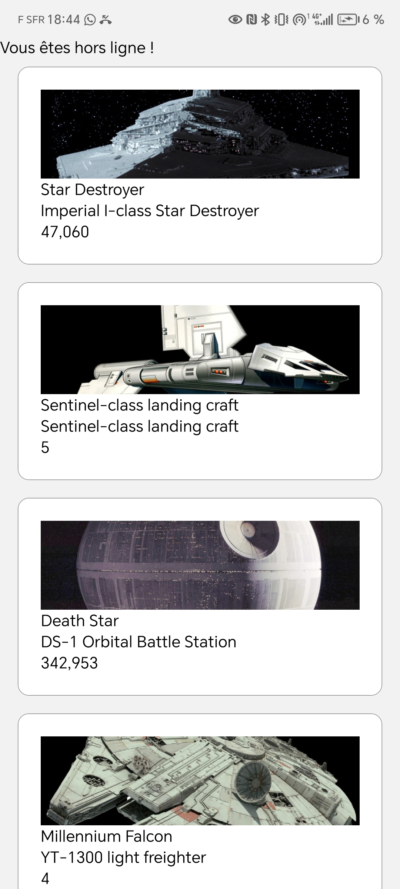

AVANCEMENT WORKSHOP : 

Foundation :

1. Fait
2. Fait
3. Fait
4. Fait
5. Fait

Data Layer :

1. Fait
2. Fait
3. Fait

Ecosystem :

1. Fait
2. Fait
3. Fait
4. X
5. X

React Navigation :

1. Fait
2. Fait
3. Fait mais non fonctionnel
4. X

Release :
1. Fait
2. X
3. X
4. X

Hackathon :
Fait